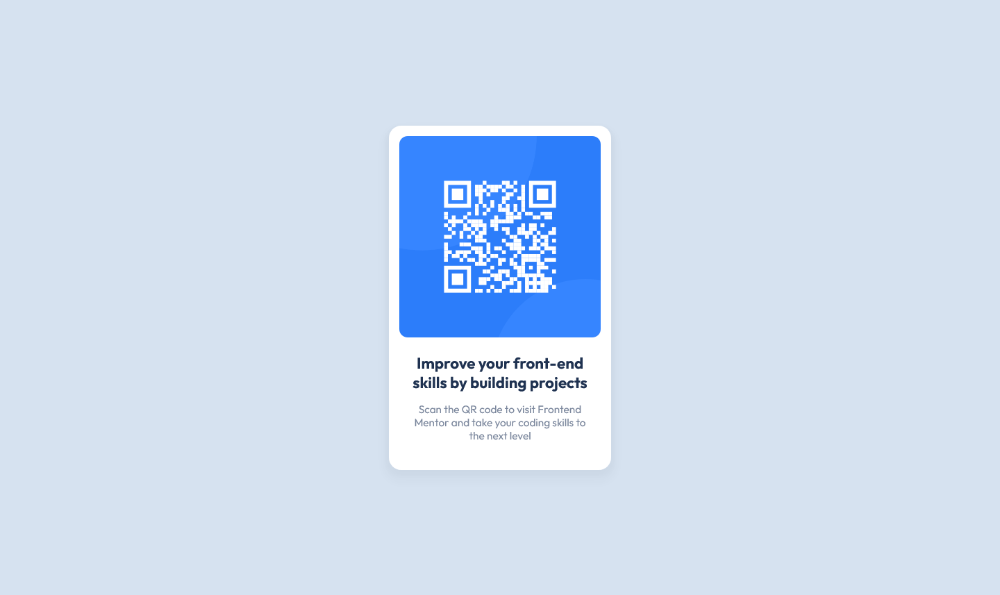

# Frontend Mentor - QR code component solution

This is a solution to the [QR code component challenge on Frontend Mentor](https://www.frontendmentor.io/challenges/qr-code-component-iux_sIO_H). Frontend Mentor challenges help you improve your coding skills by building realistic projects. 

## Table of contents

- [Overview](#overview)
  - [The challenge](#the-challenge)
  - [Screenshot](#screenshot)
- [My process](#my-process)
  - [Built with](#built-with)
- [Author](#author)

## Overview

### The challenge

Your challenge is to build out this QR code component and get it looking as close to the design as possible. Users should be able to view the optimal layout depending on their device's screen size.

### Links

- Solution URL: [GitHub](https://github.com/sergii-moroz/QR-Code-Component)

## My process

[YouTube]()

### Built with

- HTML5
- SASS

## Author

- Frontend Mentor - [link](https://www.frontendmentor.io/profile/sergii-moroz)

### Screenshot

